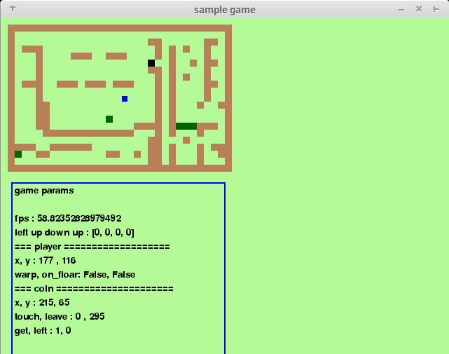

# pygame sample

### how to play
#### install
requipments : pygame
$ pip install pygame # to install pygame
$ python game.py

#### operation
Arrow keys : player move
z : replace coin
Esc : exit game

### rule
rule is to get coins until they disapper

#### player
drawn as blue rect
Arrow keys to move.
reflected by walls.
when touching warmhole, warp to warmhole exit

#### wall
drawn an broun

#### warmhole
drawn as green

#### coin
drawn as brown
when reft for a while, it is replaced
when touched by player for a while, it is replaced
z key to replace

### to do
i want to do these things
1. implement space division search to make it faster to collision detection
2. make faster list_tree_to_list  # because of recursion
3. implement AI player
4. player who has neural net
5. more useful UI